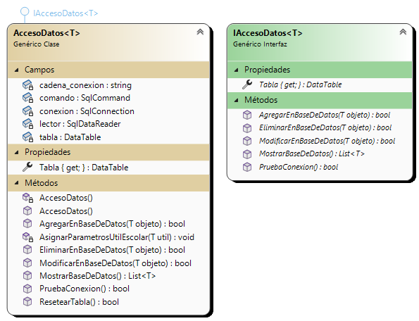
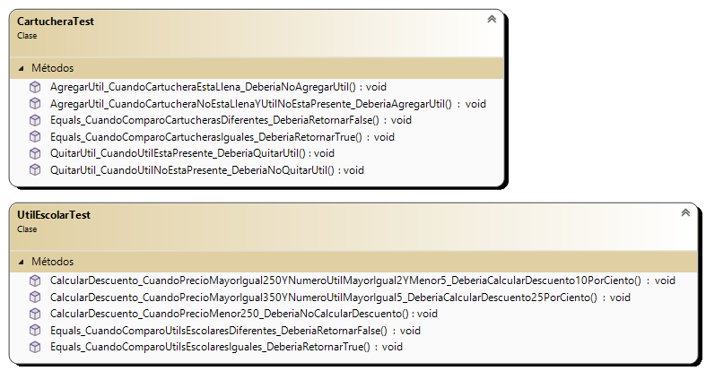

# CRUD - Utiles Escolares - SP LAB_II

## Resumen:
Mi aplicación es de Gestión de Utiles Escolares, lapiceras, reglas, sacapuntas. Permite a los usuarios realizar diferentes acciones en relación a estos. Usa una base de datos en la cual se almacenan los utiles, la cual permite agregar, modificar y eliminar. La aplicación adapta las acciones disponibles según los permisos del usuario. Los administradores tienen acceso completo al CRUD, los supervisores al CRU y los vendedores solo al R. Explora y gestiona tu inventario de útiles escolares de manera eficiente y personalizada.

### Formulario Login: 

### Formulario Bienvenida: 

### Formulario Principal (Dos Diseños):

### Cómo usar la aplicación:
1. *Login*: Para comenzar, inicia sesión en la aplicación utilizando una de las cuentas disponibles.
2. *Agregar*: Una vez dentro, encuentra un menú de opciones. Selecciona "Agregar" para incluir nuevos útiles escolares en el panel de la derecha, ya sea una lapicera, un sacapuntas o una regla.
3. *Ordenar*: Explora las opciones de ordenamiento para organizar el panel. Puedes ordenar ascendente o descendente, por precio, marca o número de útil. Haz clic en el menú de opciones y elige "Ordenar".
4. *Modificar*: Si necesitas hacer cambios en algún útil, selecciona la opción de modificación en el menú. Modifica los detalles de los elementos existentes en la lista según tus necesidades.
5. *Eliminar*: Para quitar un útil de la lista, haz clic en la opción de eliminación en el menú y selecciona el elemento que deseas eliminar.
6. *Exportar*: Realiza copias de seguridad de tu base de datos o lista de útiles. Selecciona la opción "Exportar" en el menú, elige la ubicación y guarda en formato JSON.
7. *Recuperar (Solo lectura)*: Accede a la opción de recuperación para visualizar una copia de seguridad en modo solo lectura. Esto te permite ver el respaldo sin la posibilidad de agregar, modificar o eliminar. Para volver al modo normal, selecciona "Cambiar Diseño Base de Datos".
8. *Ver - Logins*: Visualiza los logins de todos los usuarios que han ingresado a la aplicación, junto con la hora de acceso.
9. *Utilizar*: Pon a prueba los útiles escolares con mensajes de prueba. Selecciona "Utilizar" para interactuar con los elementos.
10. *Cambiar Diseño*: Alterna entre dos diseños posibles: una lista desplegable (list box) y una tabla de base de datos.

## Diagrama de Clases:
### Diagramas Generales:

### Diagramas Individuales:
#### Diagramas Forms:

#### Diagramas Entidades:

#### Diagramas Excepciones:

#### Diagramas Pruebas Unitarias:

#### Diagramas Base de datos Biblioteca:

El diagrama de clases muestra la estructura de la lógica de negocio de la aplicación.  Está construido con la herramienta Visual Studio y está actualizado a la última versión entregada de la solución.